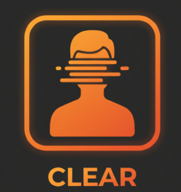

# CLEAR-anonymization
## CLEAR: Comprehensible Learning for Entity Anonymization and Recognition 


CLEAR is a tool and method using for the Named Entity Recognition.


### Getting the data 

#### LER Dataset

First you need to download the LER dataset using the following script inside the `data` folder:
```bash
python scripts/download_dataset.py --repository_id elenanereiss/german-ler --output_path data/ler/ler_dataset.json 
```


#### LLM Baseline

First, start running the LLM model, e.g. google/gemma-3-27b-it locally using a VLLM:

```bash
python -m vllm.entrypoints.openai.api_server   --model google/gemma-3-27b-it  --host 0.0.0.0   --port 8000
```

```python
from clear_anonymization.extractors import factory
LLMExtractor = factory.make_extractor("llm", model="google/gemma-3-27b-it", prompt_path=clear_anonymization/prompts/ner_task_2.txt)
LLMExtractor.predict("Frau Müller arbeitet beim Bundesgericht.")


[{'start': 0, 'end': 11, 'text': 'Frau Müller', 'entity': 'PERS'}, {'start': 26, 'end': 39, 'text': 'Bundesgericht', 'entity': 'ORG'}]
```

