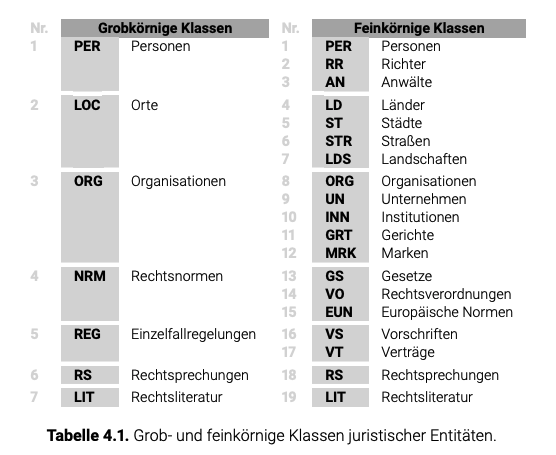

### Legal-Entity-Recognition 
- von Bundesministerium der Justiz und für Verbraucherschutz auf dem Portal "Rechtsprechung im Internet" veröffentlicht worden
- besteht aus 750 Entscheidungen der Jahre 2017-2018
- Entscheidungen stammen aus sieben Bundesgerichten:
    1) Bundesarbeitsgericht (BAG)
    2) Bundesfinanzhof (BFH)
    3) Bundesgerichtshof (BGH)
    4) Bundespatentgericht (BPatG)
    5) Bundessozialgericht (BSG)
    6) Bundesverfassungsgericht (BVerfG)
    7) Bundesverwaltungsgericht (BVerwG)
- 66723 Sätzen (2.157.048 Tokens mit Satzzeichen und 1.868.355 ohne Satzzeichen beinhaltet)
- verfügt über zwei Varianten für die Klassifikation der juristischen Entitäten
    - grobkörnige Variante mit 7 Klassen
    - feinkörnige Variante mit 19 Unterklassen
- Anonymisierung von Daten bereits gemacht, dies betrifft Personen-, Orts-, und Organisationsnamen
    - Namen werden durch einen oder zwei Buchstaben, meistens gefolgt von einem Punkt, gefolgt von einem Auslasugspunkt oder durch Auslasungspunkte ersetzt

- manuell in WebAnno annotiert
- insgesamt gibt es 56.632 annotierte Entitäten die aus 413.082 Token bestehen
    - PER, LOC, ORG -> bilten mit 25.66% ein Viertel aller Entitäten (Hälfte davon sind Organisationsnamen)
    - Anteil an juristischen Entitäten, welche zu Namen und Zitate gehören 3fach grösser - 74.34%
- PER: 
    1) PER - Kläger, Beklagten, Zeugen, Gutachter
    2) RR - Richter
    3) AN - Anwälte
- LOC:
    1) LD - Länder, Staaten, Gliedstaaten
    2) ST - Städte, Dörfer, Gemeinden
    3) STR - Strassen, Plätze, Alleen, Stadtbezirke, Sehenswürdigkeiten
    4) LDS - Landschaften, Kontinente, Berge, Seen, Flüsse & weitere geographische Objekte
- ORG:
    1) ORG - gesellschaftliche & öffentliche Einrichtungen wie Parteien, Vereine, Verbände, Zentren, Gemeinschaften, Unionen, Bildungsstätten oder auch Forschungseinrichtungen
    2) INN - Institutionen, staatliche Einrichtungen, Bundesministerien- & - behörden, Landesministerien & - behörden, sonstige Anstalten und Dienststellen, Bundestag, Bundesregierung...
    3) UN - Unternehmen, private wirtschaftliche Einrichtungen
    4) GRT - Gerichtsbezeichungen, Bezeichungen der Bundes-, Oberlands-, Lands- und Amstgerichte,
    5) MRK - Marken, Ergonymen (von Menschen geschaffen)
- NRM: Rechtsnormen
    1) GS: Gesetze, die vom Gesetzgeber (Bundestag, Bundesrat) beschlossene Gesetze
    2) VO: Rechtsverordungen, vom Bundes- oder Landesregierung, Ministerium anhand einer Ermächtigung beschlossen
    3) EUN: Normen des Europäischen Primärrechts, Europäischen Sekundärrechts, Europäischen Organisationen, & weitere Übereinkommen und Abkommen,  
- REG: Einzelfallregelungen, verbindliche Rechtsakte die unterhalb jeder Rechtsnorm stehen 
    1) VS: Vorschriften,  Anweisungen von einer übergeordneten Behörde an eine nachgeordnete die deren Tätigkeit regelt
    2) VT: Verträge, eine Einigung zwischen Subjekten zu verstehen,  öffentlich-rechtliche Verträge, Staatsverträge, Tarifverträge
- RS: Rechtsprechungen
    - Zitate von Entscheidungen
    - spiegel Verweise auf Entscheidungen wider, in welchen stets der Name der amtlichen Entscheidungssammlung, des Bandes und die nummerierte Textstelle zu einer zitierten Aussage genannt werden
- LIT: Rechtsliteratur 
    - Zitate der Rechtskommentare, Gesetzgebungsmaterilien, Rechtslehrbücher, und - monographien

### MULTI-EURLEX
- mehrsprachiger Datensatz zur Themenklassifizierung von Rechtsdokumente
- umfasst 65000 Gesetzte der Europäische Union die offiziell in 23 Sprachen übersetzt wurden
- Jedes EU-Gesetz wurde vom Publikationsamt der EU EUROVOC-Labels annotiert
- EUROVOC hat 8 Konzeptebene
- Jedem Dokument ist ein oder mehrere Labels zugewiesen

- wenn ein Dokument einem Konzept zugeordnet wird, werden normalerweise die Vorfahren & Nachfahren dieses Konzepts nicht demselben Dokument zugewiesen
- 4 sets von Gold-Labels für ein Dokument bereitgestellt 

